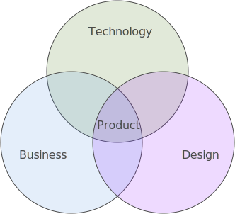

# Product Teams

Product design teams are cross functional groups of individuals that collaborate closely to better understand the problem they are attempting to solve and identify, test and consolidate findings on the multitude of solutions that the product could embody. In technical product work the collaborating parties often involved in product development consist of business, technology and design. Each of these areas have skills and insight that are brought together to inform and enrich the products we create. Often the skills and responsibilities of people on product teams go beyond their core competencies and sit between two of these three or more of these areas.

This section will have two main focuses: practitioner skills and team methodologies or process. The skills and methodologies in this section do not attempt to be a comprehensive list, rather they inform on sets of options for teams to incorporate to better their ability to build products. This section has also been divided up into the core areas discussed above, however, many of the skills are cross functional and can be categorized under multiple of the functionalities. Therefore, we have done our best to align the skills with the functionality we felt best fit the responsibilities of that skill.

